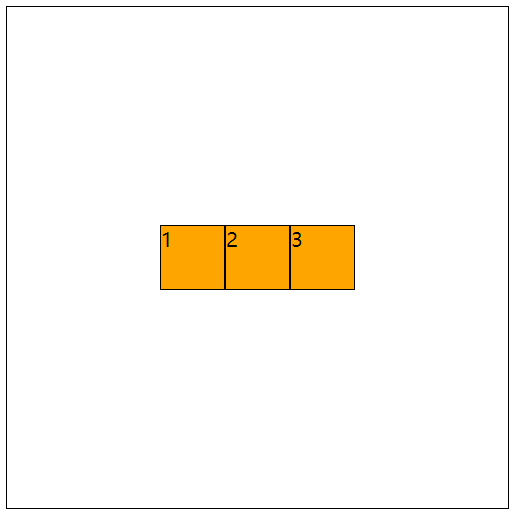
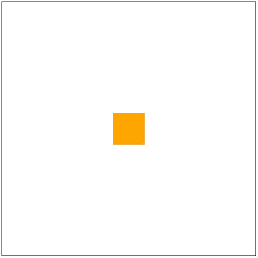
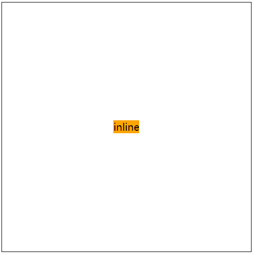
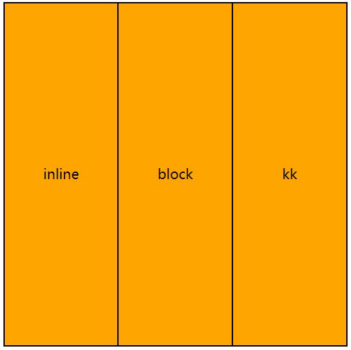

# CSS水平垂直居中

## flex布局

子元素高度可以设置也可以不设置

> 父元素为flex布局时设置父元素 `justify-content: center;align-items: center;`分别代表子元素水平居中，和垂直居中。
```css
.parent {
  width: 400px;
  height: 400px;
  border: 1px solid black;
  display: flex;
  justify-content: center;/* 水平排列时表示水平居中 */
  align-items: center;/* 水平排列时表示垂直居中 */
  /* 以上两个属性在列排列时相反 */
}
.child {
  width: 50px;
  height: 50px;
  border: 1px solid black;
  background-color: orange;
}
```
效果如下：



## position布局

子元素高度可以设置也可以不设置

> 子元素为绝对定位，`margin: auto;`, 水平居中：`left: 0;right: 0;`,垂直居中`top: 0;bottom: 0;`

```css
.parent {
  width: 400px;
  height: 400px;
  border: 1px solid black;
  position: relative;
}
.child {
  width: 50px;
  height: 50px;
  background-color: orange;
  position: absolute;
  left: 0;
  right: 0;
  top: 0;
  bottom: 0;
  margin: auto;
}
```
效果如下：



## position布局 2

子元素高度可以设置也可以不设置

```css
.parent {
  width: 400px;
  height: 400px;
  border: 1px solid black;
  position: relative;
}
.child {
  width: 50px;
  height: 50px;
  background-color: orange;
  position: absolute;
  top: 50%;
  left: 50%;
  transform: translate(-50%,-50%);
  /* 这里的水平居中可以换成margin: 0 auto; */
}
```
效果如下：


## 子元素为行内元素

```css
.parent {
  width: 400px;
  height: 400px;
  border: 1px solid black;
  text-align: center;
  line-height: 400px;
}
.child {
  display: inline;
  background-color: orange;
}
```
效果如下：



## table布局

无法设置子元素宽高

> 父元素设置为：`display: table;`，子元素设置为：`display: table-cell;`

```css
.parent {
  width: 400px;
  height: 400px;
  border: 1px solid black;
  display: table;
  text-align: center;/* 子元素水平居中 */
}
.child {
  display: table-cell;
  vertical-align: middle;/* 垂直居中 */
  width: 50px;
  background-color: orange;
  border: 1px solid black;
}
```
效果如下：

